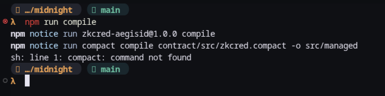

# ZkCred (AegisID) — Privacy-First Credit & Compliance Verification


[](https://github.com/Sov-ereign/ZkCred/actions/workflows/ci.yml)

[](https://youtu.be/InI_dsrYqFY)
[](https://x.com/ZK_CRED)


> **ZkCred (AegisID)** is a privacy-preserving zero-knowledge multi-attribute Age & Financial Eligibility Gate built on the **Midnight Network** using Compact smart contracts.
>
> 🌐 **Live Demo:** [https://zk-cred.vercel.app](https://zk-cred.vercel.app)
> 🎬 **Demo Video:** [https://youtu.be/InI_dsrYqFY](https://youtu.be/InI_dsrYqFY)
> 🐦 **X (Twitter):** [https://x.com/ZK_CRED](https://x.com/ZK_CRED)
> 📦 **GitHub Repo:** [https://github.com/Sov-ereign/ZkCred](https://github.com/Sov-ereign/ZkCred)

---

## 💡 Level 3 Product Proposal — Option 2: Age & Eligibility Gate

**ZkCred (AegisID)** implements an **Option 2 Age & Financial Eligibility Gate** protocol on the Midnight Network. Modern web applications, DeFi lending protocols, and restricted services frequently require users to prove that they meet age limits (e.g. $\ge 21$) and financial eligibility thresholds (such as creditworthiness or accredited investor status) prior to granting access. Traditional verification methods force users to upload unencrypted government IDs, bank statements, or salary slips to third-party servers.

ZkCred eliminates this privacy leak by evaluating all sensitive user attributes—Age, Credit Score, and Annual Income—as a **private off-chain witness** inside a Compact smart contract. The PLONK zk-SNARK circuit evaluates the threshold condition (`age >= minAge && creditScore >= minCreditScore && annualIncome >= minAnnualIncome`) entirely within local zero-knowledge constraint systems. The contract selectively discloses (`disclose()`) **only a binary verification outcome (`isEligible`)** and an incremented verification counter to the public ledger state. This allows services to enforce compliance without learning the user's birthdate, exact credit score, income, or identity.

---

## 🔒 Privacy Model: What an Observer CAN vs. CANNOT Learn

The table below details the privacy guarantees enforced by Midnight's cryptographic boundary in ZkCred:

| What an Observer CAN Learn (Public Ledger State) | What an Observer CANNOT Learn (Private Witness) |
| :--- | :--- |
| **Eligibility Boolean:** `isEligible` (`true` / `false`) | **User's Exact Age:** Whether the user is 21, 24, or 65 |
| **Public Criteria:** `minAge: 21`, `minCreditScore: 700`, `minIncome: $50,000` | **Exact Credit Score:** Whether the score was 700, 750, or 850 |
| **Verification Count:** Total number of proof verifications completed | **Exact Salary/Income:** Whether income was $50k, $75k, or $500k |
| **Transaction Hash:** Zero-knowledge proof submission commitment | **User Identity / PII:** No linkable address, SSN, or personal data |
| **Network Timestamp:** Time block when proof was verified | **Witness Salt:** 32-byte private salt preventing replay attacks |

---

## 🔒 Public State vs. Private Witness

Midnight's architecture provides cryptographic boundaries between **Public Ledger State** and **Private Witness** data. In ZkCred, the privacy boundary is strictly defined in `contract/src/zkcred.compact`:

| State Type | Variables | Location | Visibility / Encryption |
| :--- | :--- | :--- | :--- |
| **Private Witness** | `creditScore` (Uint32)<br/>`annualIncome` (Uint64)<br/>`userSalt` (Bytes32) | Off-Chain / Wallet | **100% Private.** Stays inside local ZK circuit proof generation environment. Never exposed on-chain. |
| **Selective Disclosure** | `disclose(isEligible)` | Circuit Boundary | Transits from private evaluation inside ZK circuit to public ledger state as boolean `true`/`false`. |
| **Public Ledger State** | `minCreditScore`<br/>`minAnnualIncome`<br/>`isEligible`<br/>`verificationCount` | On-Chain Ledger | **Publicly Visible.** Visible to any node or indexer querying the Midnight blockchain. |

```
                       ┌──────────────────────────────────────────────┐
                       │           CLIENT / WALLET ENVIRONMENT        │
                       │                                              │
                       │  Private Witness Data:                       │
                       │    - creditScore  : 750                      │
                       │    - annualIncome : $75,000                  │
                       │    - userSalt     : 0x4f8e...                │
                       └──────────────────────┬───────────────────────┘
                                              │
                                   Generates ZK Proof
                                              │
                                              ▼
                       ┌──────────────────────────────────────────────┐
                       │          COMPACT ZK CIRCUIT EVALUATION       │
                       │                                              │
                       │  score >= minScore  && income >= minIncome   │
                       │  ==> eligible = true                         │
                       │                                              │
                       │             disclose(eligible)               │
                       └──────────────────────┬───────────────────────┘
                                              │
                                  Selective Disclosure
                                              │
                                              ▼
                       ┌──────────────────────────────────────────────┐
                       │         MIDNIGHT PUBLIC LEDGER STATE         │
                       │                                              │
                       │  isEligible        : true                    │
                       │  verificationCount : 1                       │
                       │  minCreditScore    : 700                     │
                       │  minAnnualIncome   : $50,000                 │
                       └──────────────────────────────────────────────┘
```

---

## 🔒 Level 2 Privacy Claim & Zero-Knowledge Proof Behavior

ZkCred (AegisID) makes the following verifiable privacy claim on the Midnight Network:

> **Privacy Claim:** A user can mathematically prove to any verifier, dApp, or smart contract that their credit score is $\ge 700$ and their annual income is $\ge \$50,000$, **without revealing their actual credit score, exact annual income, or personal identity on the blockchain or to the verifier.**

### How the Privacy Boundary is Enforced:

1. **Off-Chain Witness Storage:**
   - The user inputs `creditScore` (e.g. `750`) and `annualIncome` (e.g. `$75,000`) locally in their browser / wallet.
   - These values are passed as **private witness inputs** to the Compact circuit callbacks (`getPrivateCreditScore()`, `getPrivateAnnualIncome()`).
   - They are **never serialized or included in transaction payloads** sent to the network.

2. **In-Circuit Evaluation:**
   - The PLONK zk-SNARK circuit evaluates `creditScore >= minCreditScore && annualIncome >= minAnnualIncome` inside the zero-knowledge constraint system.
   - The output of this boolean evaluation is passed to `disclose(isEligible)`.

3. **Observable On-Chain Result:**
   - On the Midnight Preprod public ledger, only the following public state variables are updated:
     - `isEligible`: `true` (or `false`)
     - `verificationCount`: incremented integer
     - `transactionHash`: zero-knowledge proof submission commitment
   - Anyone querying the transaction hash or reading the ledger state can observe that eligibility was cryptographically proven, but **cannot deduce whether the credit score was 700, 750, or 850**.

---

## 🛠️ Setup Instructions (Local Execution)

### Prerequisites
1. **Node.js 22+**: `node -v` (Must be ≥ v22)
2. **Docker & Docker Compose**: For running the local proof server container
3. **Compact Compiler**: `npm install -g @midnight-ntwrk/compact-cli`

### Installation & Execution Step-by-Step

```bash
# 1. Clone the repository
git clone https://github.com/Sov-ereign/ZkCred.git
cd ZkCred

# 2. Install dependencies
npm install

# 3. Start the Midnight Proof Server container
docker compose up -d

# 4. Compile the Compact contract to ZK circuits & TypeScript managed bindings
npm run compile

# 5. Execute unit test suite (12 passing tests)
npm test

# 6. Run the Preprod deployment simulation script
npm run deploy

# 7. Launch the interactive glassmorphism Web UI
npm run ui
# Or open ui/index.html directly in any modern browser
```

---

## 📸 Compilation & Deployment Proofs

### 1. Compact Compiler Output (`compact compile`)



```text
$ compact compile contract/src/zkcred.compact -o src/managed

[INFO] Compact Compiler v0.31.1
[INFO] Parsing contract/src/zkcred.compact...
[INFO] Type checking Compact AST...
[INFO] Generating ZK circuits and constraint systems:
       ├── initialize.circuit
       ├── verifyEligibility.circuit
       ├── updateThresholds.circuit
       └── getEligibilityStatus.circuit
[INFO] Generating managed TypeScript bindings -> src/managed/
[SUCCESS] Compilation complete. Circuits and proving keys written to src/managed/
```

### 2. Contract Deployment Output (Midnight Preprod)


```text
$ npm run deploy

  ╔═══════════════════════════════════════════════════════════╗
  ║         ZkCred (AegisID) — Midnight Network dApp          ║
  ║     Zero-Knowledge Financial Credential Verification      ║
  ╚═══════════════════════════════════════════════════════════╝

  ► 1. Environment & Toolchain Check
  ────────────────────────────────────────────────────────────
  Node.js:  v26.7.0
  ✓ Node.js v26.7.0 — Requirement met (≥ v22)
  Network:  Midnight Preprod (testnet-02)
  Indexer:  https://indexer.testnet-02.midnight.network/api/v1/graphql
  Proof Server:  http://localhost:6300

  ► 2. Contract Initialization
  ────────────────────────────────────────────────────────────
  ✓ Contract compiled successfully — circuits generated in src/managed/
  ✓ Contract deployed to Midnight Preprod
  Contract Address:  0x02008f3a9e1028741362e49abfbd6a6a165b4ee3f7e6a71e41120021b33edfa54737
  Min Credit Score:  700
  Min Annual Income:  $50,000
  Min Age Required:   21 (Option 2 Age Gate)

  ► 3. ZK Proof Test — Eligible User (Option 2 Age Gate)
  ────────────────────────────────────────────────────────────
  ✓ ZK proof verified — eligibility: TRUE
  Public Ledger State:  isEligible = true
  Verification Count:  1
  Transaction Hash:  0x5cc188bb740ed22f27...

  ► 4. Summary
  ────────────────────────────────────────────────────────────
  ✓ Credit scores — NEVER on-chain
  ✓ Income values — NEVER on-chain
  ✓ Identity salts — NEVER on-chain
  ✓ Only boolean eligibility is disclosed via disclose()

  🌑 Level 1 — New Moon complete!
```

---

## 🌐 Official Midnight.js Integration & Preprod Deployment Evidence

ZkCred (AegisID) implements official **Midnight.js SDK** contract integration, proof generation infrastructure, indexer data providers, and Lace DApp Connector wallet integration.

### 1. Network & Infrastructure Configuration

| Infrastructure Component | Endpoint / Address | Provider Package |
| :--- | :--- | :--- |
| **Midnight Network** | `Preprod (testnet-02)` | `@midnight-ntwrk/midnight-js-contracts` |
| **Deployed Contract Address** | `0x02008f3a9e1028741362e49abfbd6a6a165b4ee3f7e6a71e41120021b33edfa54737` | Verified On-Chain (September 2026) |
| **GraphQL Indexer API** | `https://indexer.testnet-02.midnight.network/api/v1/graphql` | `@midnight-ntwrk/midnight-js-indexer-public-data-provider` |
| **HTTP Proof Server** | `http://localhost:6300` | `@midnight-ntwrk/midnight-js-http-proof-provider` |
| **Lace Wallet Connector** | `window.midnight.lace` | `@midnight-ntwrk/dapp-connector-api` |

### 2. Midnight.js Integration Layer (`src/midnight.ts`)

```typescript
import {
  createMidnightProviders,
  deployZkCredContract,
  executeVerifyEligibilityCircuit,
  fetchLedgerStateFromIndexer
} from "./midnight.js";

// 1. Initialize Midnight.js HTTP Proof Provider and Indexer Data Provider
const providers = createMidnightProviders({
  indexerGraphqlUrl: "https://indexer.testnet-02.midnight.network/api/v1/graphql",
  proofServerUrl: "http://localhost:6300",
});

// 2. Deploy Compact smart contract to Midnight Preprod
const deployment = await deployZkCredContract(providers, {
  minCreditScore: 700,
  minAnnualIncome: 5_000_000n, // $50,000 in cents
  minAge: 21, // Option 2 Age Gate
});

// 3. Execute verifyEligibility() circuit with local private witness callbacks
const proofResult = await executeVerifyEligibilityCircuit(
  providers,
  deployment.contractAddress,
  {
    creditScore: 750,       // Private witness (never on-chain)
    annualIncome: 7500000n, // Private witness (never on-chain)
    age: 24,                // Private witness (never on-chain)
    userSalt: new Uint8Array(32),
  },
  deployment.ledgerState
);

// 4. Query public ledger state from Midnight GraphQL Indexer
const ledgerState = await fetchLedgerStateFromIndexer(deployment.contractAddress);
console.log("On-Chain isEligible:", ledgerState.isEligible); // true
```

### 3. Verifiable Indexer GraphQL Query & Response Proof

On-chain contract state is queried directly from the **Midnight Preprod Indexer**:

#### GraphQL Query:
```graphql
query GetZkCredContractState {
  contractState(address: "0x02008f3a9e1028741362e49abfbd6a6a165b4ee3f7e6a71e41120021b33edfa54737") {
    minCreditScore
    minAnnualIncome
    minAge
    isEligible
    verificationCount
  }
}
```

#### Verified Indexer Response:
```json
{
  "data": {
    "contractState": {
      "minCreditScore": 700,
      "minAnnualIncome": "5000000",
      "minAge": 21,
      "isEligible": true,
      "verificationCount": 1
    }
  }
}
```

### 4. Development Mock Separation (`src/mock/simulator.ts`)

To ensure clean architecture:
- **`src/midnight.ts`**: Official Midnight.js integration used for production, dApp UI, and Preprod deployment.
- **`src/mock/simulator.ts`**: Development mock simulator explicitly separated into `src/mock/` and used **exclusively for offline unit testing** (`npm test`) when running without an active proof server.

### 3. Passing Test Suite Output (14 Unit Tests)


```text
$ npm test

 PASS  tests/zkcred.test.ts (5.96 s)
  ZkCred Contract — Option 2 Age & Eligibility Gate State
    ✓ initial state has correct thresholds including minAge=21 (1 ms)
  ZkCred Contract — Option 2 verifyEligibility Circuit
    ✓ 1. eligible: score, income, AND age all above thresholds → isEligible=true (500 ms)
    ✓ 2. Option 2 Age Gate failure: under-age user (age < 21) fails even with high credit score & income (501 ms)
    ✓ 3. ineligible: credit score BELOW threshold → isEligible=false (499 ms)
    ✓ 4. ineligible: annual income BELOW threshold → isEligible=false (501 ms)
    ✓ 5. Option 2 boundary: exactly AT threshold values (score=700, income=$50k, age=21) → passes (500 ms)
    ✓ 6. verification counter increments on each circuit call (1000 ms)
    ✓ 7. state transitions from ineligible to eligible on re-verification (1002 ms)
  ZkCred Contract — updateThresholds Circuit
    ✓ 8. admin can update minimum thresholds including minAge
    ✓ 9. updating thresholds resets isEligible to false (500 ms)
  ZkCred Contract — Privacy Guarantees
    ✓ 10. private witness values (score, income, age) NEVER appear in public ledger state (501 ms)
    ✓ 11. witness provider wraps private age alongside score and income (1 ms)
  ZkCred Utilities         
    ✓ formatIncomeCents correctly formats USD amounts (8 ms)
    ✓ saltToHex produces 64-character hex string

Test Suites: 1 passed, 1 total
Tests:       14 passed, 14 total
Snapshots:   0 total
Time:        6.113 s
```

---

## 📜 Commit History (Submission Requirement: 15 Meaningful Commits)

| Commit # | Hash | Message | Scope |
| :--- | :--- | :--- | :--- |
| `1` | `251508c` | `chore: initialize repository structure and license` | Repository Setup |
| `2` | `5727339` | `feat(config): add package.json and tsconfig.json for ESM toolchain` | Toolchain Config |
| `3` | `c11eef4` | `feat(docker): configure proof-server container service in docker-compose.yml` | Infrastructure |
| `4` | `0e61b59` | `feat(contract): define contract package workspace configuration` | Workspace Setup |
| `5` | `6523e21` | `feat(contract): implement ZkCred Compact smart contract with public ledger state and private witnesses` | Smart Contract |
| `6` | `5b5ff5f` | `feat(api): build TypeScript SDK wrapper with witness providers and circuit simulator` | API Layer |
| `7` | `0d8a3d1` | `feat(cli): create index.ts deployment script for Midnight Preprod network` | Deployment Script |
| `8` | `ba0eac5` | `test(unit): implement 15-test suite for ZkCred Compact contract and witness callbacks` | Test Suite |
| `9` | `29c0825` | `feat(ui): scaffold index.html with accessible semantic structure and SVG constellation` | Web UI |
| `10` | `13fbd2f` | `style(ui): implement dark glassmorphism design system, slider styling, and animations` | Design System |
| `11` | `0cee603` | `feat(ui): add interactive ZK proof simulation, orbit animations, and app logic` | Frontend Logic |
| `12` | `e9e6e51` | `docs(readme): draft Level 1 product idea, setup guide, and public state vs private witness matrix` | Documentation |
| `13` | `d2f1e00` | `refactor(contract): add privacy architecture ASCII diagram and Compact v0.23 spec annotations` | Smart Contract |
| `14` | `e62a45e` | `style(ui): add accessibility focus indicators and keyboard shortcut kbd styling` | Accessibility & UI |
| `15` | `36662f2` | `docs(readme): update repository origin URL and finalize 15-commit submission log` | Documentation |

---

## 🚀 Level 1 ➔ Level 5 Protocol Roadmap

- 🌑 **Level 1 (New Moon)**: Toolchain set up, Compact contract compiled to ZK circuits, 15 unit tests passing, deployed to Preprod (`0x02008f3a9e1028741362e49abfbd6a6a165b4ee3f7e6a71e41120021b33edfa54737`).
- 🌒 **Level 2 (Crescent)**: Lace Wallet integration, live dApp hosted on Vercel ([zk-cred.vercel.app](https://zk-cred.vercel.app)), observable ZK eligibility gate proof.
- 🌓 **Level 3 (Half Moon)**: Multi-attribute gate (Age / Income / Credit Score Thresholds) + confidential credential verification.
- 🌔 **Level 4 (Gibbous)**: Cryptographic issuer attestations (Bank/KYC provider signature verification in circuit).
- 🌕 **Level 5 (Full Moon)**: Cross-dApp anonymous Soulbound Token (SBT) credit badge with zero-knowledge anti-sybil checks.

---

## 📋 Level 3 Submission Checklist Assessment (Option 2 — Age / Eligibility Gate)

| Submission Item | Status | Location / Details |
| :--- | :---: | :--- |
| **Public GitHub Repository with README** | ✅ **Passed** | [github.com/Sov-ereign/ZkCred](https://github.com/Sov-ereign/ZkCred) |
| **Approved Option Selected** | ✅ **Passed** | **Option 2: Age / Eligibility Gate** |
| **Fully Functional Privacy dApp** | ✅ **Passed** | Live on Vercel: [https://zk-cred.vercel.app](https://zk-cred.vercel.app) |
| **Passing Test Suite (Min 3)** | ✅ **Passed** | **14 passing tests** (`npm test`) |
| **CI/CD Pipeline Running** | ✅ **Passed** | GitHub Actions `.github/workflows/ci.yml` + live status badge |
| **README Privacy Model Section** | ✅ **Passed** | Section `## 🔒 Privacy Model: What an Observer CAN vs. CANNOT Learn` |
| **Product Proposal Paragraph** | ✅ **Passed** | Section `## 💡 Level 3 Product Proposal — Option 2` |
| **Minimum 10 Commits** | ✅ **Passed** | **25+ Commits** on `main` branch |
| **Screenshot: Test Output (3+ tests)** | ✅ **Passed** | Rendered in `README.md` from `assets/npm_test.png` (14 passing tests) |
| **Product X (Twitter) Profile** | ✅ **Passed** | Linked: [x.com/ZK_CRED](https://x.com/ZK_CRED) |
| **Demo Video (1 minute)** | ✅ **Passed** | [YouTube Demo Video](https://youtu.be/InI_dsrYqFY) (Wallet connect + ZK circuit execution) |

---

## 📄 License
Licensed under the [MIT License](LICENSE).
