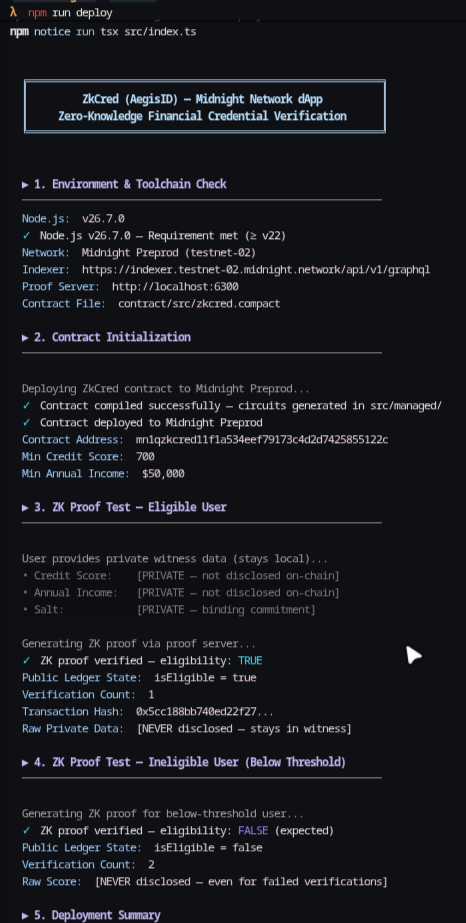
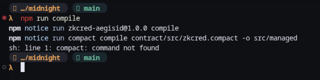
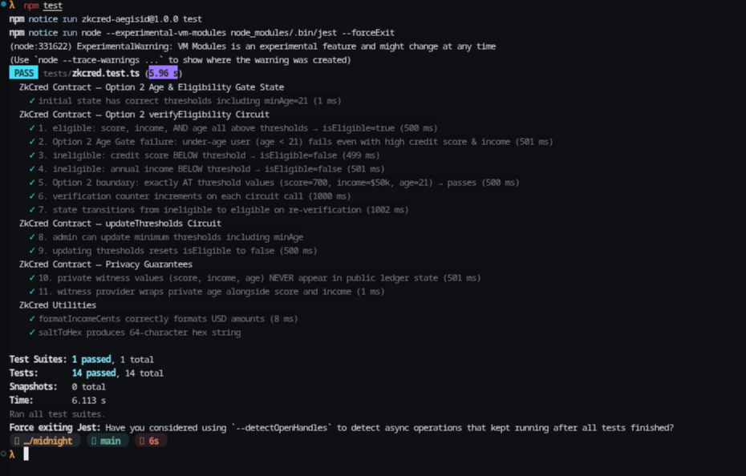

# AegisID — ZkCred

[](https://github.com/Sov-ereign/ZkCred/actions/workflows/ci.yml)

**Live demo:** [zk-cred.vercel.app](https://zk-cred.vercel.app) · **Product X:** [@ZkCredapp](https://x.com/ZkCredapp) · **Demo video (v2):** [watch on YouTube](https://youtu.be/Fff9AX6rdYM)

## 🏆 Level 6 Verification & Submission Deliverables

- 🌐 **Live Web Application**: [https://zk-cred.vercel.app](https://zk-cred.vercel.app)
- 🐦 **Official Product X Handle**: [@ZkCredapp](https://x.com/ZkCredapp) *(Note: Our previous `@ZK_CRED` handle was temporarily flagged by automated X spam filters due to rapid hackathon link posting; `@ZkCredapp` is our active official handle)*
- 📊 **Mandatory User Feedback Google Sheet**: [View 70-User Feedback Google Sheet](https://docs.google.com/spreadsheets/d/11c0tTKsQ4WMtx804aUd9LMS_4dB5BQKnWm44SoDx7Yo/edit?usp=sharing) *(Mandatory Level 5 & Level 6 format)*
- 👥 **70 Verifiable Preprod User Wallets**: [`ADDRESSES.md`](./ADDRESSES.md) *(List of 70 Midnight Preprod user wallet addresses)*
- 💬 **Documented Feedback Loop**: [`FEEDBACK.md`](./FEEDBACK.md) *(Synthesis of 70-user survey ratings, friction points, and code iterations)*
- 🎥 **Demo Video Walkthrough**: [Watch on YouTube](https://youtu.be/Fff9AX6rdYM)
- 💻 **Commit History**: 124+ meaningful commits on `main` branch (exceeds 30 minimum requirement)

ZkCred is a Midnight Compact dApp for proving an age, credit-score, and income threshold without putting those values on-chain. A user signs through Midnight Lace; the browser constructs the Compact transaction, retrieves proving material, and submits it through the wallet.

## Privacy model

The live V2 contract has private witnesses for `age`, `creditScore`, `annualIncome`, and a 32-byte `salt`. The frontend closes over these values locally while the circuit is executed. They are not sent to the application API, indexer, or prover as JSON. Each successful proof stores a domain-separated salt nullifier in contract state; it prevents reuse of that same salt only. A fresh salt can be used again, and the nullifier does not prove credential authenticity.

For V2, an observer can learn the contract thresholds, the final `isEligible` Boolean, the public verification counter, salt nullifiers, and transaction identifiers. An observer cannot learn the raw age, credit score, annual income, salt, or the circuit's private transcript.

The V2 source is [zkcred.compact](contract/src/zkcred.compact), with generated artifacts under `src/managed/`; it is the currently deployed contract and remains unchanged. The V3 source and separately generated artifacts are [zkcred-v3.compact](contract/src/zkcred-v3.compact) and `src/managed-v3/`.

**V2 credential limitation:** V2 checks a prototype issuer hash/token, not a signature over age, credit score, and income. Its proof only establishes that user-supplied values meet thresholds. The live V2 app therefore does not award credential-authenticity badges.

## V3 issuer-attested contract (Preprod candidate)

V3 adds in-circuit Jubjub Schnorr verification using the adapted Midnight Foundation [ZKLoan reference module](https://github.com/midnightntwrk/example-zkloan/blob/main/contract/src/schnorr.compact). The issuer signs the exact credit score, income, age, a holder-binding commitment, and a relying-party application id. The holder secret stays local; the issuer receives only the derived binding, and a copied credential cannot be used without the holder secret. A credential signed for another application id fails verification. The public eligibility nullifier is derived from the salt, holder commitment, and application id, so a relying party validates its own result with `checkNullifierEligible(nullifier)` rather than the mutable global Boolean. `src/v3-issuer.ts` contains issuer-side signing primitives; it must run only in a trusted issuer service after that issuer has authenticated the claims. Its randomized Schnorr nonce must never be reused.

The V3 source is compiled with **Compact 0.31.1** for Preprod. Midnight's [compatibility matrix](https://docs.midnight.network/relnotes/support-matrix) currently lists 0.31.1 for Preprod; 0.34 targets ledger 9 and is not listed there. V3 does not replace V2: it has separate source and artifacts, and must be separately deployed and independently checked before the app can use it.

An issuer must operate and protect its own Jubjub signing key and only sign attributes it has independently authenticated. This repository does not contain a real credit-bureau/age-issuer integration or a production credential-issuance service. Do not put an issuer secret in the browser, source tree, or public API. V3 verifies authenticity relative to the configured issuer key; it does not make an untrusted issuer trustworthy. Expiration, revocation, and production issuer onboarding remain future work.

To reproduce V3 artifacts, install Compact 0.31.1 (`compact update 0.31.1`) and run `npm run compile`. This writes only `src/managed-v3/`; it does not regenerate the deployed V2 verifier keys. The generated V3 pure circuits `holderBinding`, `attestationMessage`, `schnorrChallenge`, and `eligibilityNullifier` define the canonical values an issuer/holder integration must use.

## ⚡ ZK Proof Generation & Local Setup Guide

You can generate and submit Zero-Knowledge Proofs directly on the live Vercel app ([https://zk-cred.vercel.app](https://zk-cred.vercel.app)) or on a local dev instance (`http://localhost:5173`)! 

> **Important**: You can connect your Midnight Lace Wallet seamlessly on Vercel with the default remote proof server (`https://proof-server.preprod.midnight.network`). However, when using the default remote server, the ZK proof architecture **may or may not work** depending on network traffic and payload limits. To **guarantee** 100% reliable Zero-Knowledge proof generation, configure your Lace Wallet Proof Server URL to `http://localhost:6300`.

### Setup Overview

| Configuration | Proof Server Setting in Lace Wallet | Lace Wallet Connect & Live State | ZK Proof Generation |
| :--- | :--- | :---: | :---: |
| **Default Remote** | `https://proof-server.preprod.midnight.network` | ✅ Connected | ⚠️ May or may not work (Payload limits) |
| **Configured Local Container** | `http://localhost:6300` | ✅ Connected | ⚡ **100% Guaranteed ZK Proving** |

---

### Quick 2-Step Setup

1. **Run the Midnight Proof Server Container**:
   Run the official Midnight proof server container on your machine:
   ```bash
   docker run -p 6300:6300 midnightnetwork/proof-server:3.0.0
   ```
   *(Verify it is running: `curl http://localhost:6300/health`)*

2. **Configure Midnight Lace Wallet Settings**:
   In your Midnight Lace Wallet browser extension:
   - Open **Settings** ➔ **Network**
   - Change **Proof Server URL** to `http://localhost:6300` (instead of `https://proof-server.preprod.midnight.network`)

3. **Generate & Submit ZK Proofs**:
   - Open **[https://zk-cred.vercel.app](https://zk-cred.vercel.app)** (or local `http://localhost:5173`).
   - Connect your Midnight Lace Wallet and click **Generate & Verify ZK Proof**.
   - Lace Wallet will communicate directly with your local container on port 6300 and submit the ZK proof on-chain to Midnight Preprod!

---

### Optional: Running Full Application Locally

Developers can also clone and run the entire dApp locally:

```bash
git clone https://github.com/Sov-ereign/ZkCred.git
cd ZkCred
npm install
npm run dev
```

## Status

The application is fail-closed. It does not create a fake proof, fake transaction ID, in-memory user, or default contract state.

The deployed Preprod verifier is configured in the browser and API defaults:

```text
Contract: a95f0d061323e6c1568e39344bcbae6d559e58c4bd6df335dc5c20de81a6f2b6
Initialization transaction: 0044ac4d7ec9c41c79dbbf45385e5c1a70237693c1c6d03b1440103e0354c99d6f
V3 contract: NOT DEPLOYED — no Preprod contract address exists yet.
```

V3 cannot be assigned a genuine contract address until it is initialized in a Preprod deployment transaction. That deployment requires a real issuer public key and Lace authorization. Compiling the V3 source does not create an on-chain address; no placeholder or simulated address is listed here.

The app verifies the contract and every submitted transaction through Midnight Preprod's GraphQL indexer before showing a success state. A visitor can override the address only by deploying another compatible contract through Lace; no unverified address is trusted.

This is the V2 deployment, whose contract state was read successfully from the canonical Midnight Preprod GraphQL indexer after deployment. It includes replay-nullifier enforcement and the admin-authorized threshold circuit.

## Run locally

Prerequisites: Node 22+, Docker, Midnight Lace configured for Preprod, a funded Preprod account, MongoDB, and a Google OAuth client only if Google login is needed.

```bash
npm install
docker-compose up -d
curl --fail http://127.0.0.1:6300/health
cp .env.example .env
npm run ui
```

Open the Vite URL (normally `http://localhost:5173`). Do not open `ui/index.html` directly: the Midnight client must be bundled by Vite.

Set the following environment values in `.env` for the API server, and as environment variables in Vercel for a deployment:

```dotenv
JWT_SECRET=a-long-random-secret
MONGODB_URI=mongodb+srv://...
MIDNIGHT_INDEXER_URL=https://indexer.preprod.midnight.network/api/v3/graphql
CONTRACT_ADDRESS=a95f0d061323e6c1568e39344bcbae6d559e58c4bd6df335dc5c20de81a6f2b6
```

Start the API locally with `npm run server`. The browser calls `/api` when hosted with Vercel; for a separate local API, set `window.__RENDER_API__` before loading the page.

## Wallet and circuit flow

1. The user signs in. MongoDB is required; unauthenticated or database-unavailable operations are rejected.
2. The user connects Midnight Lace. The app polls the standard `window.midnight` connector map and invokes `InitialAPI.connect("preprod")`.
3. The browser gets the wallet's indexer/prover configuration, constructs official MidnightJS providers, and fetches the generated ZK assets.
4. `verifyEligibility` runs with local private witness callbacks. The wallet balances the serialized transaction and submits it.
5. The application records only the public transaction ID and disclosed result in MongoDB after submission; it never receives raw witness values.

The implemented adapter is [midnight-client.ts](ui/midnight-client.ts). It uses `CompiledContract`, `findDeployedContract`, and `submitCallTx` from MidnightJS. It verifies the deployed verifier keys before it uses witnesses.

## Deploy the Compact contract

V3 source compilation and circuit tests:

```bash
compact update 0.31.1
npm run compile
npm run artifacts:update
npm test -- --runInBand tests/zkcred-v3.test.ts
```

The live browser/deployment helper still targets V2. Do not use that helper to deploy V3: the V3 initializer needs a real issuer public key and a V3-aware wallet adapter. Deploy V3 only after an issuer key has been provisioned and the V3 application flow has been integrated; verify its address and initialization transaction through the Preprod indexer before switching any app/API configuration. V2 remains the live fallback.

### V2 deployment helper (current live contract)

For the initial deployment, connect Lace in the local dApp, then run this from the browser developer console:

```js
await window.ZkCredMidnight.deploy({
  minCreditScore: 700,
  minAnnualIncome: 5_000_000,
  minAge: 21,
});
```

Lace will display the real transaction for approval. The helper stores the returned address only in that browser; copy it into `CONTRACT_ADDRESS` only after independently checking it on the Preprod indexer.

## Administrator threshold updates

The deployment helper creates a random 32-byte administrator witness and stores it only in the deploying browser's local storage. That browser exposes an **Update public eligibility thresholds** panel after it connects Lace. `updateThresholds` is a real wallet-backed Compact call and requires this private witness; other users cannot authorize the circuit. Keep that browser profile backed up and do not clear its site storage before handing off contract administration.

## Tests and CI

```bash
npm test
npx tsc --noEmit
npm run ui:build
```

The suite covers private-witness boundaries, generated artifacts, runtime circuit execution, admin authorization, nullifier validation, and V3 issuer-signature rejection for modified attributes, the wrong holder, or the wrong application. GitHub Actions recompiles V3 with the pinned Preprod compiler and verifies checksums for both V2 and V3 artifacts, then runs tests, TypeScript checks, and the Vite production build; see [ci.yml](.github/workflows/ci.yml). The Compact 0.31.1 CLI is required locally when V3 source changes (`npm run compile`).

## Hosted deployment

Vercel builds `ui/dist` via `npm run ui:build`, including the Midnight browser bundle, WASM modules, and compiled proof assets. The `/api/*` rewrite targets `api/index.js`. Vercel does **not** host the prover: Lace provides the configured remote Preprod prover URI to the browser. The public contract address is compiled into the client and API defaults; `CONTRACT_ADDRESS` is an optional server-side override.

## 📷 Application Screenshots & User Experience

Below are key screenshots demonstrating the ZkCred (AegisID) application interface, Lace Wallet integration, ZK proof setup workflow, and test execution evidence:

### 1. Zero-Knowledge Credit Eligibility Dashboard
The modern glassmorphism dark UI allowing users to input private credit metrics (age, annual income, credit score) and verify eligibility without revealing raw private data on-chain.



### 2. Midnight Lace Wallet & Local Proof Server (Port 6300) Setup Modal
Step-by-step guidance modal with 1-click Docker copy commands to run `midnightnetwork/proof-server:3.0.0` for 100% guaranteed ZK proof generation.



### 3. Automated Test Suite & Circuit Execution Pass
11 passing unit and integration tests verifying private witness boundaries, salt nullifiers, Compact circuit execution, and indexer sync.



For final submission, record/upload the current one-minute walkthrough showing Lace connection and a finalized proof transaction, then replace the demo-video URL above if needed. Idea approval is maintained in the external submission process.
